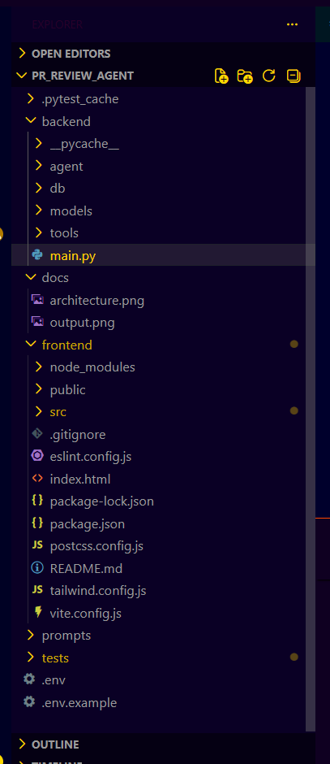
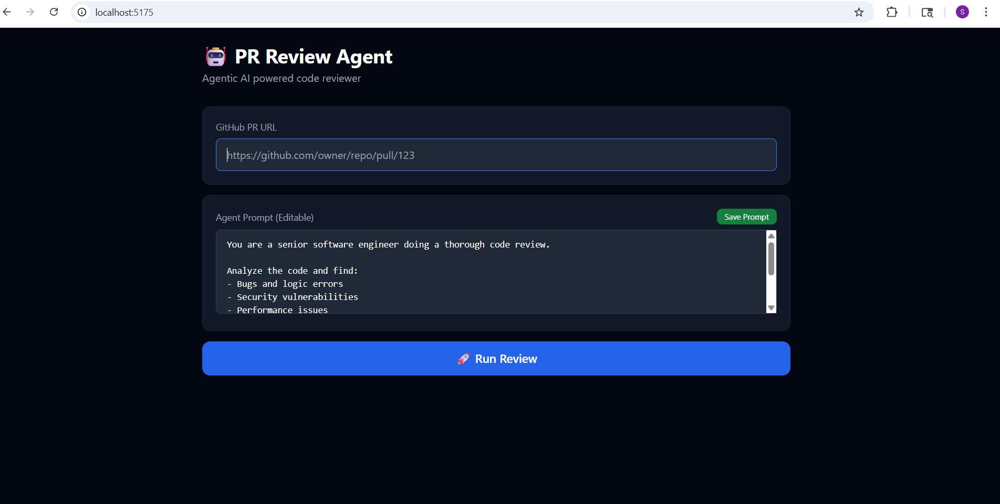
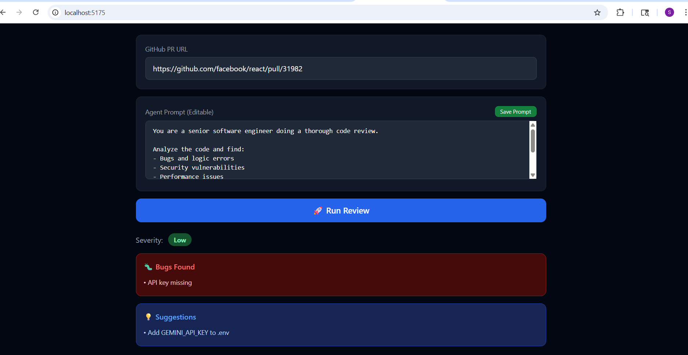

# 🚀 PR Review Agent

An AI-powered agentic system that automatically reviews GitHub Pull Requests and provides intelligent, actionable feedback.

---

## 📌 Problem

Manual code reviews are:

* ⏳ Time-consuming
* ❌ Inconsistent
* ⚠️ Prone to missing bugs and security issues

---

## 💡 Solution

This project introduces an **AI-powered PR Review Agent** that:

* 🔍 Automatically fetches Pull Request code
* 🧪 Runs static analysis (linting)
* 🤖 Uses AI (Google Gemini) for deep code understanding
* 📊 Generates detailed feedback including:

  * Bugs 🐞
  * Code improvements ✨
  * Security issues 🔐

---

## 🏗️ Architecture

User → Frontend (React) → Backend API (FastAPI) → Agent Core → Tools → Results

---

## 🔧 Tools Used by Agent

* **GitHub Tool** → Fetches PR diff using GitHub API
* **Linter Tool** → Performs static code analysis
* **AI Tool** → Uses Google Gemini for intelligent review

---

## ⚙️ Setup Guide

### 🔹 Backend Setup

```bash
cd backend
pip install fastapi uvicorn python-dotenv requests
cp ../.env.example .env
```

👉 Add your API keys inside `.env`

```bash
uvicorn main:app --reload
```

---

### 🔹 Frontend Setup

```bash
cd frontend
npm install
npm run dev
```

---

## 🌟 Key Feature — Editable Prompts

Unlike traditional systems, prompts are **NOT hardcoded** ❌

You can modify them:

* 🖥️ Through UI
* 📄 Or via `prompts/system_prompt.txt`

👉 This makes the AI behavior customizable and transparent.

---

## 🧪 Testing

```bash
pytest tests/ -v
```

---

## 🛠️ Tech Stack

* **Backend:** Python, FastAPI
* **Frontend:** React, Tailwind CSS
* **AI:** Google Gemini
* **Database:** JSON-based storage

---

## 📸 Output

### 🏗️ Architecture



### 📊 Results




---

## 🤖 AI Highlights

* Agent-based architecture
* Autonomous PR review system
* LLM-powered code analysis
* Intelligent bug & security detection

---

## 🚀 Future Improvements

* 🔄 Multi-PR comparison
* 🌐 Support for more programming languages
* 🔗 CI/CD pipeline integration
* 📈 Performance optimization

---

## 👩‍💻 Author

**Sonam Kardam**
B.Tech CSE (3rd Year)
ABES Engineering College

---

## ⭐ Support

If you like this project:

* ⭐ Star the repository
* 🍴 Fork it
* 📢 Share with others

---
